# Vibe Coders README: Knowledge STORM 🌪️

**STORM & Co-STORM: Your AI Research Assistant for Deep Dives**

[](https://opensource.org/licenses/MIT)
[](https://www.python.org/downloads/release/python-3100/)

[](https://github.com/psf/black)
[](https://badge.fury.io/py/knowledge-storm)

_Stop drowning in search tabs! STORM helps you research topics deeply and write structured, Wikipedia-style articles using AI._

---

## What's This All About? (The "What & Why") 🤔

Ever tried researching a complex topic online? You end up with 50 browser tabs, scattered notes, and still feel lost. **STORM** is like hiring a super-smart AI research assistant.

**What it does:**
*   Takes a topic you're curious about (e.g., "The History of AI Art").
*   Uses AI (specifically, Large Language Models or LLMs) to automatically search the internet like a pro.
*   Asks smart questions from different angles to uncover hidden details.
*   Organizes the findings into a neat outline.
*   Writes a detailed, Wikipedia-style article *with citations* based on its research.

**Co-STORM** takes it a step further, letting *you* jump into the research conversation with the AI agents to guide the process and explore specific angles you care about!

**Who is this for?**
*   Anyone who needs to quickly get up to speed on a new subject.
*   Students, writers, researchers, or just curious minds!
*   "Vibe coders" or prompt engineers who want to see how complex AI systems are built and maybe tweak them without getting lost in hardcore code.

**Why is it cool?** It automates the tedious parts of research (finding sources, organizing info) so you can focus on understanding the topic. Co-STORM adds a human touch, making the AI work *with* you.

---

## Tech Stack 🛠️ (What's Under the Hood?)

This project uses some modern tools, but don't worry, you don't need to be an expert in all of them to run it!

| Area             | Technologies                                                                 | Why it's used                                      |
| :--------------- | :--------------------------------------------------------------------------- | :------------------------------------------------- |
| **Language**     | Python (version 3.10 or newer is needed!)                                    | The main language for the AI logic.                |
| **AI Framework** | [dspy-ai](https://github.com/stanfordnlp/dspy)                               | Helps structure prompts and logic for LLMs.        |
| **LLM Access**   | [litellm](https://github.com/BerriAI/litellm)                                | Connects to various LLMs (OpenAI, Anthropic, etc.) |
| **Web Search**   | Various APIs (You.com, Bing, Google, Serper, etc.)                           | Gets information from the internet.                |
| **Text Handling**| `wikipedia`, `sentence-transformers`, `trafilatura`, `langchain-text-splitters` | Processing and understanding text data.            |
| **Vector DB**    | `qdrant-client` (Optional)                                                   | For searching within your own documents.           |
| **Demo UI**      | [Streamlit](https://streamlit.io/) (in `frontend/demo_light/`)               | Creates a simple web interface for demos.          |

*Minimum Python Version: 3.10*

---

## Key Features ✨

*   **Automated Research:** Give it a topic, it searches the web.
*   **Multi-Perspective Questioning (STORM):** Asks questions like different experts would to get diverse info.
*   **Simulated/Collaborative Conversations (STORM/Co-STORM):** AI agents "talk" to each other (or you!) to refine understanding.
*   **Outline Generation:** Creates a logical structure for the final article.
*   **Article Writing:** Generates detailed text based on the research and outline.
*   **Citation Generation:** Automatically adds links to the sources it used.
*   **Mind Maps (Co-STORM):** Visually organizes information during collaborative sessions.
*   **Modular Design:** Easier to understand and potentially modify parts.
*   **Flexible LLM/Search Support:** Plugs into many different AI models and search engines via `litellm` and custom retrieval modules (`rm.py`).
*   **Grounding on Your Docs:** Can use `VectorRM` to research within your own files, not just the web.

### Project Structure (Simplified):

```plaintext
.
├── knowledge_storm/      # <== CORE PYTHON CODE LIVES HERE 🧠
│   ├── storm_wiki/       # Logic for the original STORM (Wikipedia-style)
│   ├── collaborative_storm/ # Logic for Co-STORM (Interactive)
│   ├── lm.py             # Handles talking to AI models (LLMs)
│   ├── rm.py             # Handles searching the web (Retrieval)
│   └── interface.py      # Defines how different parts connect
├── examples/             # <== RUNNABLE SCRIPTS TO TRY IT OUT! 🚀
│   ├── storm_examples/
│   └── costorm_examples/
├── frontend/             # Code for web demos (like the Streamlit one)
├── assets/               # Images, logos, etc.
├── README.md             # The main technical README
├── Vibe Coders README.md # You are here! 👋
├── requirements.txt      # List of Python libraries needed
├── setup.py              # Info for installing the code as a package
├── LICENSE               # The rules for using this code (MIT = very permissive!)
└── secrets.toml.example  # Template for your secret API keys (IMPORTANT!)
```

---

## How It Works ⚙️ (The Gist)

Think of it like an assembly line for creating knowledge.

### STORM Workflow:

1.  **Topic Input:** You give it a topic (e.g., "Quantum Computing Basics").
2.  **Research Prep:** It figures out different angles ("perspectives") to research (e.g., "History", "Applications", "Challenges").
3.  **Deep Dive:** For each angle, it simulates a chat between an "expert" AI and a "writer" AI. The expert searches the web for info and answers the writer's questions.
4.  **Outline:** It gathers all the info and organizes it into a structured outline.
5.  **Drafting:** It writes the article section by section, using the outline and citing its sources.
6.  **Polish:** It cleans up the article, adds a summary, etc.
7.  **Output:** You get a Wikipedia-style article!


### Co-STORM Workflow:

1.  **Topic Input:** You give it a topic.
2.  **Warm-Up:** It does a quick initial search and creates a starting "mind map" to organize concepts.
3.  **Collaborative Chat:** This is the core!
    *   AI **Experts** search the web and provide answers.
    *   An AI **Moderator** asks new questions based on what's found.
    *   **You** can jump in anytime to ask your own questions or steer the discussion.
    *   The **Mind Map** updates as you go.
4.  **Report Generation:** Once the chat is done, it uses the mind map and conversation history to generate a structured report.
5.  **Output:** You get a curated knowledge report reflecting the collaborative research!


---

## Prerequisites & Accounts 🔑 (Stuff You Need First)

Before you can run this, you'll need a few things:

1.  **Python:** Version 3.10 or 3.11 is required. If you don't have it, download from [python.org](https://www.python.org/downloads/). (Using `conda` or `venv` to manage Python versions is highly recommended - see Setup).
2.  **Git:** To copy the code from GitHub. [Download Git](https://git-scm.com/downloads).
3.  **API Keys (IMPORTANT!):** STORM needs to talk to external services. You'll need *at least one* of each:
    *   **A Language Model (LLM) API Key:** This lets STORM use powerful AI models for writing and reasoning. Examples:
        *   [OpenAI API Key](https://platform.openai.com/api-keys) (for models like GPT-3.5, GPT-4, GPT-4o)
        *   [Anthropic API Key](https://console.anthropic.com/settings/keys) (for Claude models)
        *   *Many others are supported via `litellm`!*
    *   **A Search Engine API Key:** This lets STORM search the internet. Examples:
        *   [Bing Search API Key](https://www.microsoft.com/en-us/bing/apis/bing-web-search-api)
        *   [You.com API Key (YDC)](https://documentation.you.com/api-reference/) (Requires sign-up)
        *   **OpenAI API Key:** Required for the default `GPT4oMiniSearchRM` which uses `gpt-4o-mini-search-preview`. Ensure the `OPENAI_API_KEY` environment variable is set.
    *   **(Optional) An Embedding Model API Key:** Needed if you use certain features or retrievers (often the same provider as your LLM, e.g., OpenAI).

**Why API Keys?** These services aren't free (beyond maybe some trial credits). The keys prove you have an account and allow the services to bill you for usage. **KEEP YOUR KEYS SECRET!** Don't share them or commit them to GitHub. We'll use a special file (`secrets.toml`) for them.

---

## Setup ⚙️ (Getting It Running - ~15 Mins)

Okay, let's get this running! We recommend using a "virtual environment" to keep things tidy.

### Option 1: Using `conda` (Recommended if you use Anaconda/Miniconda)

1.  **Open your Terminal or Command Prompt.**
2.  **Clone the code:**
    ```bash
    git clone https://github.com/stanford-oval/storm.git
    cd storm
    ```
3.  **Create a Conda environment:** (This makes a clean space just for this project)
    ```bash
    conda create -n storm_env python=3.11 -y
    ```
4.  **Activate the environment:** (You'll need to do this every time you work on the project in a new terminal)
    ```bash
    conda activate storm_env
    ```
    *(Your terminal prompt should now show `(storm_env)` at the beginning)*
5.  **Install required libraries:**
    ```bash
    pip install -r requirements.txt
    ```
6.  **Set up API Keys:**
    *   Find the file named `secrets.toml.example` in the main `storm` folder.
    *   **Copy** it and rename the copy to `secrets.toml`.
    *   **Edit `secrets.toml`** with a text editor.
    *   Fill in the API keys you got in the Prerequisites step. Remove or comment out (using `#`) the lines for services you *don't* have keys for. **SAVE THE FILE.**

### Option 2: Using `venv` (Standard Python)

1.  **Open your Terminal or Command Prompt.**
2.  **Clone the code:**
    ```bash
    git clone https://github.com/stanford-oval/storm.git
    cd storm
    ```
3.  **Create a virtual environment:** (Make sure you have Python 3.10+ installed)
    ```bash
    python -m venv storm_env
    ```
    *(Or `python3` depending on your system)*
4.  **Activate the environment:**
    *   **Windows:** `.\storm_env\Scripts\activate`
    *   **macOS/Linux:** `source storm_env/bin/activate`
    *(Your terminal prompt should now show `(storm_env)` at the beginning)*
5.  **Install required libraries:**
    ```bash
    pip install -r requirements.txt
    ```
6.  **Set up API Keys:** (Same as step 6 in the Conda instructions)
    *   Copy `secrets.toml.example` to `secrets.toml`.
    *   Edit `secrets.toml` and add your keys. Save it.

### Option 3: Install as a Package (Advanced / For using in other code)

If you just want to *use* STORM's functions in your *own* Python scripts without running the examples directly:

1.  **Activate your preferred Python environment** (conda or venv, Python 3.10+).
2.  **Install the package:**
    ```bash
    pip install knowledge-storm
    ```
3.  You'll still need to manage your API keys (e.g., using environment variables or creating a `secrets.toml` file where your script runs).

---

## Visual Setup Guide 🗺️

Here's a flowchart to visualize the setup:

```mermaid
flowchart TD
    A[Start] --> B{Have Git & Python 3.10+?};
    B -- No --> NeedGit[Install Git & Python 3.10+];
    NeedGit --> C;
    B -- Yes --> C[Clone Repo: `git clone ...`];
    C --> D{Choose Setup: Conda or venv?};

    D -- Conda --> E1[Create Env: `conda create ...`];
    E1 --> F1[Activate Env: `conda activate ...`];
    F1 --> G[Install Deps: `pip install -r requirements.txt`];

    D -- venv --> E2[Create Env: `python -m venv ...`];
    E2 --> F2[Activate Env: `source ...` or `.\...\activate`];
    F2 --> G;

    G --> H[Copy `secrets.toml.example` to `secrets.toml`];
    H --> I[Edit `secrets.toml`: Add Your API Keys!];
    I --> J[Ready to Run Examples!];
    J --> K[Success! ✅];

    style A fill:#eeeeee,stroke:#333333,color:#111111
    style B fill:#fffacd,stroke:#333333,color:#111111
    style NeedGit fill:#ffddcc,stroke:#333333,color:#111111
    style C fill:#cceeff,stroke:#333333,color:#111111
    style D fill:#fffacd,stroke:#333333,color:#111111
    style E1 fill:#cceeff,stroke:#333333,color:#111111
    style F1 fill:#cceeff,stroke:#333333,color:#111111
    style E2 fill:#cceeff,stroke:#333333,color:#111111
    style F2 fill:#cceeff,stroke:#333333,color:#111111
    style G fill:#cceeff,stroke:#333333,color:#111111
    style H fill:#ffddcc,stroke:#333333,color:#111111
    style I fill:#ffddcc,stroke:#333333,color:#111111
    style J fill:#bbf7d0,stroke:#333333,color:#111111
    style K fill:#bbf7d0,stroke:#333333,color:#111111
```



---

## Running the Project 🚀 (Let's Make Something!)

The easiest way to start is using the example scripts. Make sure your virtual environment is activated (`conda activate storm_env` or `source storm_env/bin/activate`) and your `secrets.toml` file is ready.

### Running a STORM Example (Generates a Wiki-style article)

1.  **Navigate to the examples folder:** (If you're in the main `storm` folder)
    ```bash
    # No need to cd if already in storm root
    ```
2.  **Run the GPT example:** (This uses OpenAI models and Bing search by default, assuming you put those keys in `secrets.toml`)
    ```bash
    python examples/storm_examples/run_storm_wiki_gpt.py --output-dir ./my_storm_output --do-research --do-generate-outline --do-generate-article --do-polish-article
    ```
    *   `--output-dir ./my_storm_output`: Tells it where to save the results (it will create this folder).
    *   The `--do-...` flags tell it to run all steps. You can remove some to skip steps if needed (it saves progress).
3.  **Enter a topic** when prompted (e.g., "The impact of social media on society").
4.  **Wait:** This can take a while (5-20 minutes or more depending on the topic and models) as it does research and writing. You'll see progress updates in the terminal.
5.  **Check the output:** Look inside the `my_storm_output` folder (or whatever you named it) for the generated article (usually a `.md` file) and logs.

*See `examples/storm_examples/README.md` for how to run with different search engines (like You.com, Google) or different LLMs (like Claude, Mistral, local models via Ollama).*

### Running a Co-STORM Example (Interactive Research)

1.  **Make sure you have Bing & OpenAI keys** in your `secrets.toml` for the default script.
2.  **Run the Co-STORM GPT example:**
    ```bash
    python examples/costorm_examples/run_costorm_gpt.py --output-dir ./my_costorm_output --retriever bing
    ```
3.  **Enter a topic** when prompted.
4.  **Interact:** The script will guide you. It will perform a "warm start" and then enter a loop where:
    *   The AI agents (Experts, Moderator) will discuss the topic.
    *   You'll be prompted to either **press Enter** to let the AI continue, or **type your own question/comment** to steer the conversation.
    *   Type `exit` when you want to stop the conversation.
5.  **Generate Report:** After you exit, it will organize the discussion and generate a final report.
6.  **Check the output:** Look inside `my_costorm_output` for the report and logs.

---

## Configuration & API Keys 🔑 (A Closer Look)

*   **The `secrets.toml` file is crucial.** This is where you securely store your API keys. Never share this file!
*   **Structure:** Look at `secrets.toml.example` to see the format. You need sections like `[openai]`, `[bing]`, `[you]` etc., with keys like `api_key = "YOUR_KEY_HERE"`.
*   **Which keys do I *need*?** It depends on the example script or how you configure the `Runner`.
    *   Most examples default to needing an `OPENAI_API_KEY` (for the LLM) and a search key (like `BING_SEARCH_API_KEY` or `YDC_API_KEY`).
    *   Check the specific script (`run_storm_wiki_gpt.py`, `run_costorm_gpt.py`, etc.) or its arguments (`--retriever bing`) to see what it expects.
*   **LLM Choices:** You can often specify different LLMs (e.g., `gpt-3.5-turbo`, `gpt-4o`, `claude-3-opus-20240229`) directly in the Python code if you modify the examples or write your own script. `litellm` handles connecting to them as long as you provide the right API key in `secrets.toml`.
*   **Cost:** Remember that using LLM and Search APIs costs money! Monitor your usage on the provider's website. Cheaper models (like GPT-3.5 Turbo) are faster and cost less but might produce lower-quality results than expensive ones (like GPT-4o).

---

## Status & Roadmap 🚦

Where the project is at and where it's going:

*   ✅ **STORM Core:** Researching, outlining, writing Wiki-style articles works well.
*   ✅ **Co-STORM Core:** Collaborative discourse, mind-mapping, report generation is functional.
*   ✅ **Multiple LLM/Search Support:** Good integration with many providers via `litellm` and `rm.py`.
*   ✅ **Basic Demo UI:** A Streamlit demo exists (`frontend/demo_light/`).
*   ⏳ **Human-in-the-Loop:** More ways for users to actively guide and edit during the process are being developed.
*   ⏳ **Information Abstraction:** Exploring ways to present the curated knowledge beyond just articles (e.g., summaries, structured data).
*   ⚠️ **Complex Topics:** Very niche or rapidly changing topics can sometimes challenge the AI.
*   ⚠️ **Cost Management:** Running large jobs can get expensive depending on the LLM used.
*   🔜 **More Integrations:** Adding support for even more tools and data sources.
*   🔜 **Improved UI/UX:** Making the demos and tools easier and more intuitive to use.

---

## How AI Helped Build This 🤖✨

This project heavily relies on AI, not just *for* its function, but also *in* its creation!

*   **LLMs as Building Blocks:** The core logic uses LLMs (like GPT, Claude) to perform tasks like asking questions, summarizing text, and generating the final article.
*   **Frameworks like DSPy:** Tools like `dspy-ai` help structure the interactions with LLMs, making complex AI workflows more manageable and reliable. Think of it as a way to "program" the LLM prompts more effectively.
*   **Development Assistance:** It's likely the developers used AI tools (like GitHub Copilot or ChatGPT) to help write, debug, and refactor the Python code itself!

Using AI to build AI systems like STORM is becoming common and helps accelerate development significantly.

---

## License & Attribution 📜

*   **License:** This project is shared under the **MIT License**. (See the [LICENSE](./LICENSE) file).
    *   *In simple terms:* You can pretty much do whatever you want with this code (use it, modify it, share it, even use it in commercial projects), as long as you include the original copyright notice and license text. There's no warranty provided.
*   **Based On:** This is original work from the Stanford OVAL group.
*   **Acknowledgements:** Thanks to Wikipedia, dspy-ai, litellm, and the broader open-source community!

---

## Community & Getting Help 🙌

New to coding or AI? Got stuck? Have ideas? That's awesome!

*   **Found a Bug or Have an Idea?** Open an "Issue" on the [GitHub Issues Page](https://github.com/stanford-oval/storm/issues). Explain the problem clearly or describe your suggestion.
*   **Want to Contribute Code?** Check out the main [README.md](./README.md) and [CONTRIBUTING.md](./CONTRIBUTING.md) for more technical details on how to submit changes (Pull Requests).
*   **Just Curious?** Explore the code, run the examples, and see what you can create!
*   **Contact:** For specific questions, you can reach out to the main developers listed in the main README.

**Don't be afraid to ask questions!** The goal is to make powerful AI tools accessible.

---

_Happy Researching!_ 🌪️💡